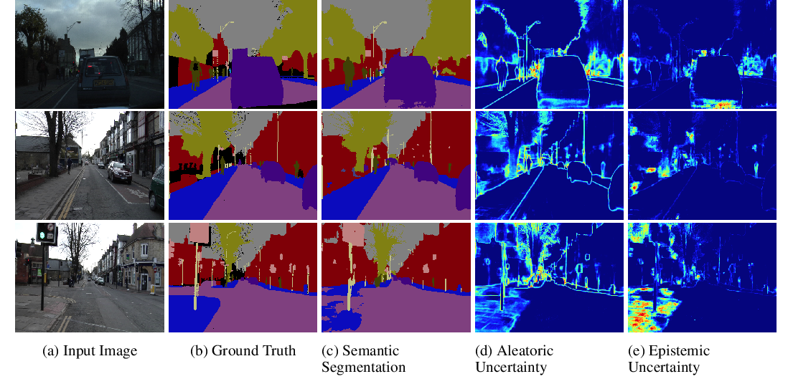
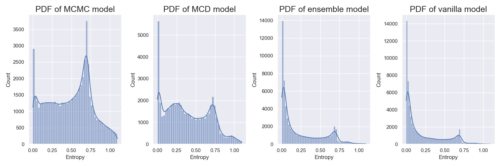
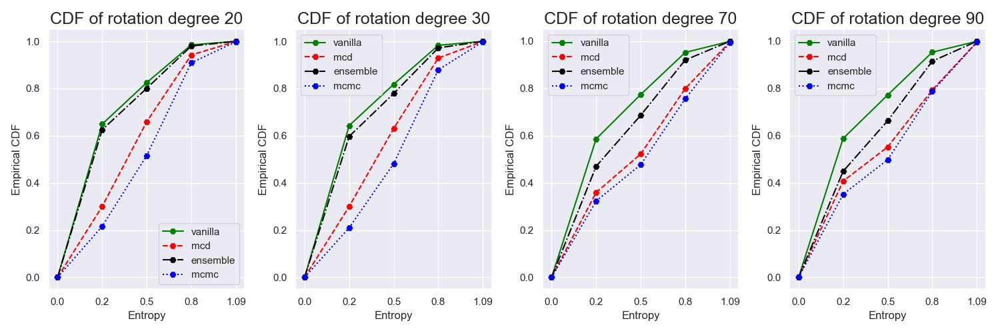
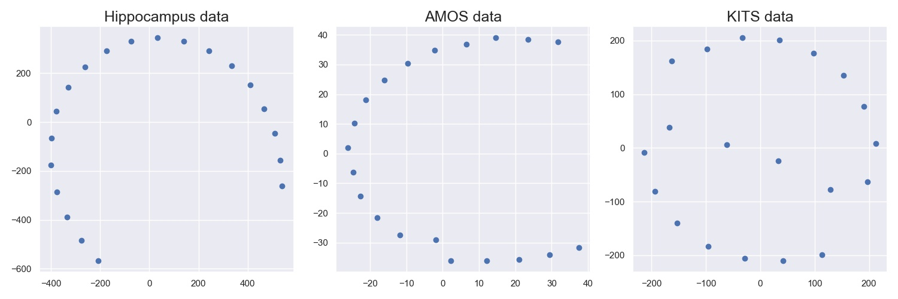

# Benchmarking Bayesian deep learning models for Uncertainty quantification under the distributional shift of 3D medical images in segmentation tasks

This repository contains code that are used in my thesis.

## ABSTRACT
In recent years machine learning approaches have been used widely in different sectors
from spam detection to chatGPT. But computer-assisted image-based disease detection
and diagnosis based on Deep Learning (DL) methods are not common practices among
medical professionals and practitioners. One of the main reasons is that typical DL
method approaches follow the assumption of using training and test datasets having the
same distribution. In the real-world problem, the deployed model is prone to face samples
that are not similar to the training dataset. The model’s performance largely depends on
the correctly labeled deployed datasets coming from the same settings. Another drawback
of traditional DL methods is that they cannot produce reliable uncertainty. This
problem makes the DL models less expressive, and less reliable to the experts. This thesis
will investigate the uncertainty estimation methods under the dataset shift in semantic
segmentation tasks. To do some, we choose one well-established commonly used uncertainty
quantification method from three families including variational inference (VI),
Monte Carlo Markov Chain (MCMC) method, and Deep Ensemble. In addition to the
segmentation performance metrics, we evaluated the aforementioned methods in terms
of several calibration metrics on the Out-of-Distribution (OOD) dataset to investigate
whether first, calibration in the in-distribution settings translates to calibration under
dataset shift, second which method is more calibrated in both in-distribution and OOD
settings. We conducted our experiments on the 3D medical image segmentation dataset
consisting of multiple organ segmentation, and tumor segmentation. From the MCMC
family, we considered Cyclical Stochastic Gradient MCMC (cSG-MCMC), which is easy
to use, requires less modification, and can explore and capture all modes of the posterior
distribution. Throughout our study, we observed that Bayesian methods based on the
MCMC methods are able to produce well-calibrated reliable uncertainty in the OOD
dataset compared to the VI method, and non-Bayesian methods including Monte Carlo
Dropout and the Deep Ensemble. This result confirms the importance of capturing
multi-modal posterior to accurately estimate epistemic uncertainty in OOD tasks.
Keywords: Medical Image Segmentation, Uncertainty Estimation, Bayesian Deep
Learning Models, Distributional Shift.

Keywords: Medical Image Segmentation, Uncertainty Estimation, Bayesian Deep
Learning Models, Distributional Shift.

# Uncertainty Estimation

  

This [Figure](https://arxiv.org/abs/1703.04977) visualizes the aleatoric and epistemic uncertainty of a semantic segmentation dataset. Figure (d) visualizes the aleatoric uncertainty on the boundaries of the
objects and for the distant object. and Figure (e) describes the epistemic uncertainty that the trained model fails to predict the challenging parts of the images.
As we are studying the uncertainty quantification under the distribution shift, this can be classified as epistemic uncertainty.

To study the quality of uncertainty estimation we used the **Probability Density
Functions (PDF)** and  **Cumulative Distribution Function (CDF)** of the
predictive entropy. We can
say a model is estimating reliable uncertainties based on the histogram visualization of
the entropy if the mode of the histogram concentrates on high values for incorrect pre-
dictions. and the  CDF of the entropy assigns high uncertainties to the OOD samples.

|  PDF  |   CDF 
|:-------------------------:|:-------------------------:
|   |   

# Cyclical Stochastic Gradient MCMC
The cSG-MCMC model provided well-calibrated uncertainty estimation for all of the OOD
datasets. The implementation of the Cyclical Stochastic Gradient MCMC (cSG-MCMC) method is proposed in this paper [Cyclical Stochastic Gradient MCMC for Bayesian Deep Learning](https://arxiv.org/abs/1902.03932).
This method is a combination of the Cyclical learning rate scheduler and the traditional SG-MCMC-based method. The main advantage of this method over the other MCMC method is that with the large initial learning rate, it can escape the local mode and explore the parameter space efficiently. It starts with a large initial learning rate which helps to escape the local mode and explore the parameter space efficiently. When the learning rate is close to zero, the samples can be collected.

  

In addition, cSG-MCMC can explore, capture, and characterize the multi-
modal posterior distribution from the complex parameter space of the modern artificial
neural network. The above figure  visualizes the parameter samples using the cSG-MCMC
method via Multi-Dimensional Scaling (MDS). It shows us that the cSG-MCMC method
explores a wide range of parameter space and the chance to capture different modes of
the posterior distribution is higher. This property of the cSG-MCMC model can lead to
the reliable presentation of the predictive uncertainty.

  

 # Dependencies
* [Python 3.8](https://www.python.org/)
* [PyTorch 1.9.0](http://pytorch.org/) 

